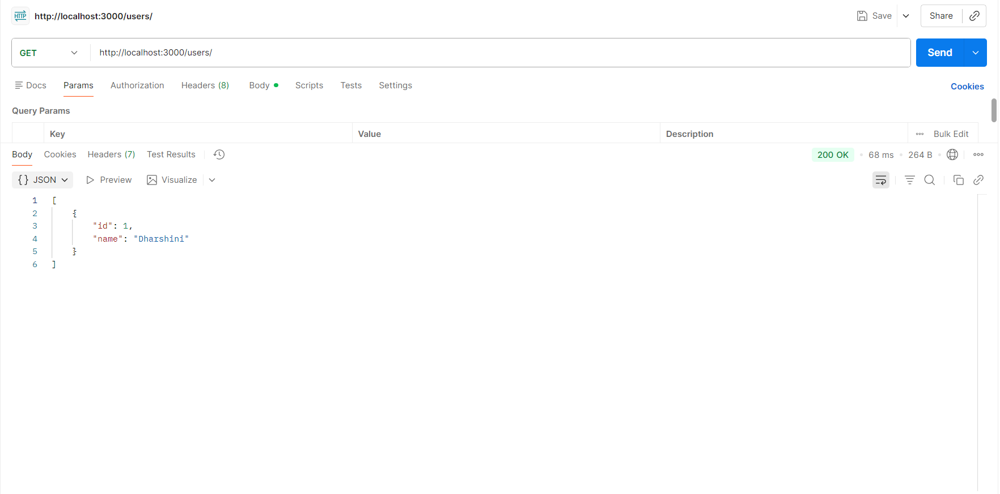

# 🚀 Postman Day 2 – CRUD API Testing

This project demonstrates CRUD operations using a **Node.js + Express** server tested in **Postman**.  
It includes all four major API operations: **GET, POST, PUT, DELETE**.

---

## 📌 CRUD Operations Covered

- **GET** — Fetch all users  
- **POST** — Create a new user  
- **PUT** — Update an existing user  
- **DELETE** — Delete a user  

Each API call is tested in Postman, and screenshots are included.

---

# 🔹 1. GET – Fetch All Users

### **GET** `http://localhost:3000/users/`

Returns all available users.

#### 📸 Screenshot  


---

# 🔹 2. POST – Create a New User

### **POST** `http://localhost:3000/users/`

#### 👉 Sample Request Body:
```json
{
  "name": "Obili"
}
**PUT http://localhost:3000/users/:id**
{
  "name": "Vino"
}
**DELETE http://localhost:3000/users/:id**


